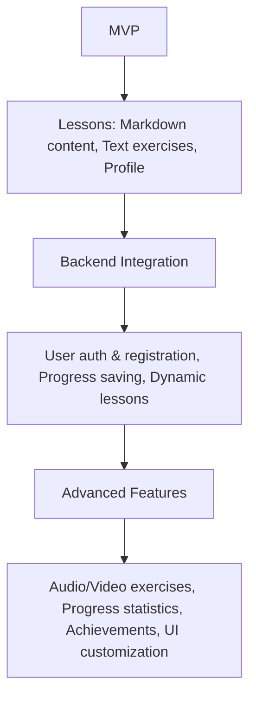

```mermaid
flowchart TD
    A[MVP] --> B[Lessons: Markdown content, Text exercises, Profile]
    B --> C[Backend Integration]
    C --> D[User auth & registration, Progress saving, Dynamic lessons]
    D --> E[Advanced Features]
    E --> F[Audio/Video exercises, Progress statistics, Achievements, UI customization]
```
